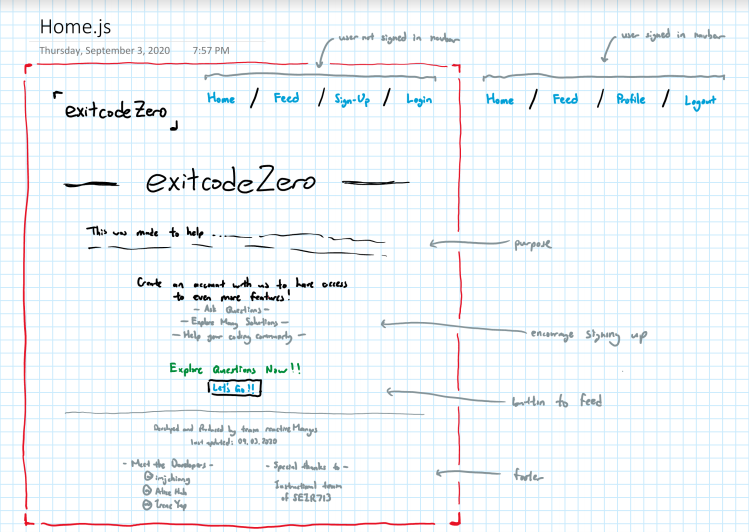
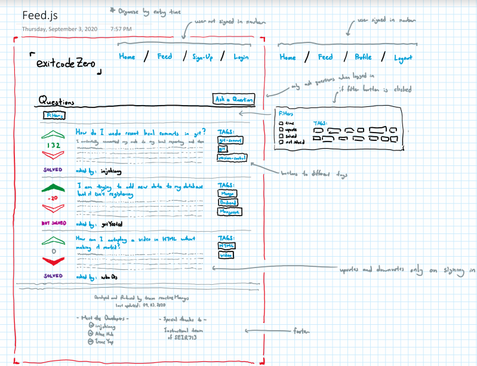
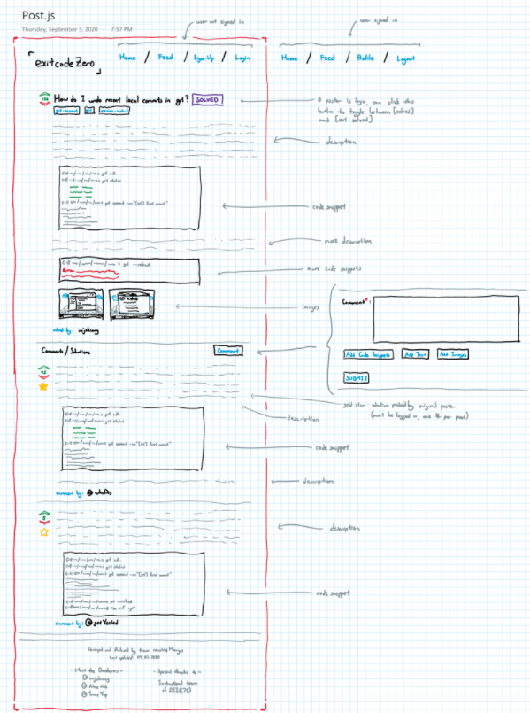
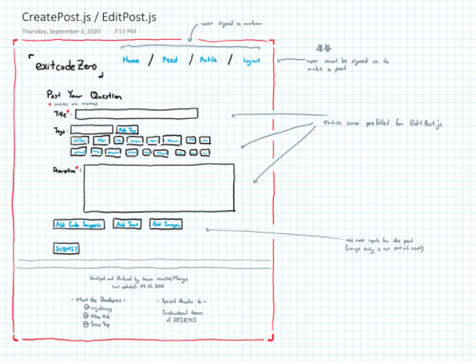
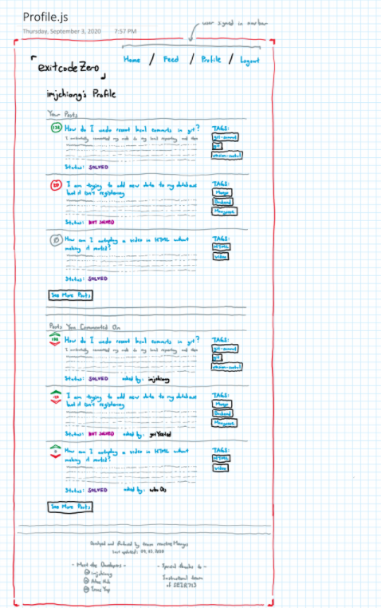

# Project 3 Pitch

## Fork & Clone this repo.

Review the [Project 3 requirements](https://tmdarneille.gitbook.io/sei-ga-sea/11-projects/project-3#project-feedback-evaluation) and check out some [examples](https://tmdarneille.gitbook.io/sei-ga-sea/11-projects/past-projects/project3).

Provide information in the following sections:

----------------------------------------------------------
### Project Overview
##### (Include project idea/concept, project name, who owns git master repo on github, team name [if desired], team member roles, elevator pitch)

- Project Name: exitcodeZERO
- Git Master Repo: @imjchiang
- Team Name: reactiveMangos
- Roles: Each individual is in charge of the listed items (all team members will collaborate on those items)
    - Josh: models/schemas, auth, git master
    - Alice: routes
    - Irene: react components
    - All: styling

- Pitch: Alternative to stack overflow

----------------------------------------------------------
### Notes
- node module involving code snippets (escape characters/md) - Josh
- if we have time: (I see you have images set up to basically be attachments. Just want to confirm that you will not try to put images directly in the body of a post or comment.) - check with Pete

----------------------------------------------------------
### Models and Schemas

scope:
- necessary (1)
- very useful (2)
- useful (3)
- unneccessary (4)

Post:       (1)
- title: string       (1)
- tags: array(tagId)       (3)
- descriptionsAndCode: array(text)       (1)
- image (optional): array       (4)
- author: (userId)       (1)
- date(optional): date       (4)
- upvote: array(userId)       (2)
- downvote: array(userId)       (2)
- comments: array(CommentId)       (1)
- solved: boolean       (2)

Comment: Embedded       (1)
- descriptionsAndCode: array       (1)
- image (optional): array       (4)
- authorCom: (userId)       (1)
- date(optional): date       (4)
- upvoteCom: array(userId)       (2)
- downvoteCom: array(userId)       (2)
- starredOnPost: boolean       (2)

Tag: Referenced        (3)
- name: string        (3)

User: Referenced       (1)
- username: string       (1)
- email: string       (1)
- password: string       (1)
- posts: array(postId)       (1)
- comments: array(commentId)       (3)
- date(optional): date       (4)

----------------------------------------------------------
### User Stories

##### Users are able to login and post issues they are having with their code

- Title: purpose of the code / error or issue they are having 
- Solved Tag: Indicates next to title whether the issue has been solved or not 
    - Clicking on this tag links to the solution the author of the question used
- Tags: tags help label and categorize the issue
- Description: describe the issue, things attempted, tried solutions, where you think potential issues are, constraints
- Code Snippets: Have option to enter in code snippets
    - can presss button to add additional snippets (ex: troubleshooting for multiple files)
- Image (optional): can post image of debugging screen, code, desired product, etc...

----------------------------------------------------------
### Wireframes

----------------------------------------------------------
### Additional Technologies
##### (MERN Stack expected [MongoDB, Express, React, Node], include any external APIs)

None

----------------------------------------------------------
### Work Allocation
##### Who is your Gitmaster? Who will be doing what? 
Each individual is in charge of the listed items (all team members will collaborate on those items)
- Josh: models/schemas, auth, git master
- Alice: routes
- Irene: react components
- All: styling

----------------------------------------------------------
### Daily Sprints
##### (or otherwise general plan for accomplishing tasks, preferably broken down by day)

Friday: 
- Set up master repo
Saturday: 
- master repo set
- models and schemas complete
- set up basic routes
- set up basic components
Sunday:
- complete "Post" routes
- complete "Post" and "Comment" components and subcomponents
- implement more auth stuff for "Post" and "Comment" routes and components
Monday:
- complete "CreatePost / EditPost" routes
- complete "CreatePost / EditPost" component and subcomponents
- implement more auth stuff for "CreatePost / EditPost" routes and components
Tuesday:
- complete "Feed" routes
- complete "Feed" component and subcomponents
- implement more auth stuff for "Feed" routes and components
Wednesday:
- complete "Profile" routes
- complete "Profile" component and subcomponents
- implement more auth stuff for "Profile" routes and components
Thursday:
- complete "Home" route
- complete "Home" component and subcomponents
- MVP reached
- add styling

----------------------------------------------------------

## Make a PR when you're done!
